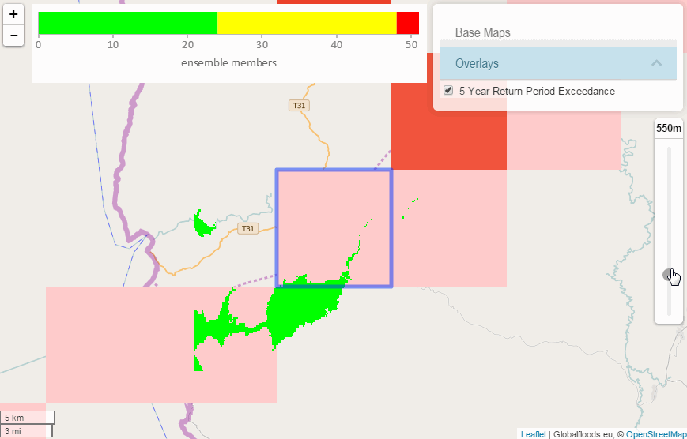

# FloodIT!

A [#FloodHack](http://floodhack.devpost.com/) project.

## Technologies

The following lists all technologies that have been used in this project.

### Standards (incl. emerging)

- [CoverageJSON](https://github.com/Reading-eScience-Centre/coveragejson) format to get DEM (digital elevation model) data easily to the browser
- [WCPS](http://www.opengeospatial.org/standards/wcps) to query data stored in [rasdaman](http://www.rasdaman.com/)
- [WMS](http://www.opengeospatial.org/standards/wms) to display Globalfloods.eu discharge maps

### Server software
- [ncWMS2](http://reading-escience-centre.github.io/edal-java/ncWMS_user_guide.html) to serve DEM data stored in netCDF as CoverageJSON via WMS (special JSON "image" format)

### JavaScript libraries
- [Leaflet](http://leafletjs.com/) for map display
- [covjson-reader](https://github.com/Reading-eScience-Centre/covjson-reader) to read CoverageJSON resources
- [leaflet-coverage](https://github.com/Reading-eScience-Centre/leaflet-coverage) to display flooding on a map (by representing the flood as a grid coverage)
- [Leaflet.StyledLayerControl](https://github.com/davicustodio/Leaflet.StyledLayerControl) for switching between layers
- [LeafletSlider](https://github.com/dwilhelm89/LeafletSlider) for setting the flooding threshold
- [CanvasJS](http://canvasjs.com/) for displaying the return level chart
